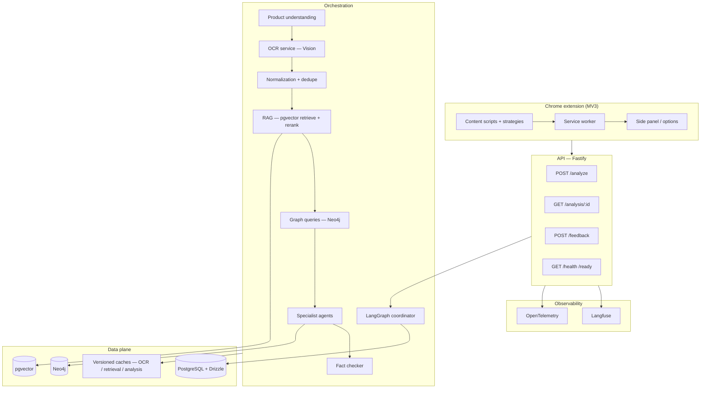

# Consumer Product Intelligence Platform — System Design (Draft)

This document aligns the **target platform specification** with the **current monorepo** (`extension/`, `api/`, `shared/`) and defines a phased path to a production-grade portfolio system.

---

## 1. Current system (as-built)

| Area | Implementation today |
|------|----------------------|
| **Frontend** | Chrome MV3 **AI Scanner**: service worker, content scripts (PDP shadow-DOM **Analyze Product** button), side panel with evidence modal + feedback thumbs, options (API URL, personalization toggles), retailer strategies (Amazon.in, Nykaa, Myntra, Blinkit, Zepto) |
| **API** | Fastify + TypeScript + Drizzle + PostgreSQL (Supabase) |
| **Health** | `GET /health`, `GET /ready` |
| **Analyze** | `POST /analyze` and `POST /analyze/product` — optional `x-api-key`; returns `analysisId`, `evidenceRefs`, `generalRisk` / `personalizedRisk`, `agentReport` |
| **Replay / feedback** | `GET /analysis/:id`, `POST /feedback` |
| **Pipeline** | Legacy deterministic stages (DOM → completeness → Vision OCR → merge → normalize → encyclopedia match → cache) orchestrated by **analyze-orchestrator** with RAG enrichment, Neo4j risk hints, Ollama recommendation agent, fact-check gate, personalization |
| **OCR** | Google Vision with **persisted** `ocr_runs` (bboxes, raw annotation JSON, cache by `image_url_hash`); `product_understanding_json` on `product_analyses` |
| **RAG** | pgvector `document_chunks`, hash/Ollama embeddings, hybrid keyword + cosine retrieval → `evidenceRefs` on API response; `pnpm rag:seed` |
| **Knowledge graph** | Optional Neo4j Aura / Docker; `pnpm graph:sync` from Postgres; read-only Cypher in Risk enrichment |
| **Agents** | Linear coordinator (`api/src/agents/graph.ts`) — extraction → research → regulatory → risk → recommendation → fact-check (wrapped in orchestrator) |
| **Personalization** | Extension preference toggles → `userPreferences` on analyze → rule engine (`api/src/personalization/evaluate.ts`) |
| **Observability** | Pipeline phase logs, in-process OTEL-style spans, optional Langfuse ingestion; `analysis_runs` cost/latency table |
| **Evaluation** | `eval/run.ts` + golden JSONL → `docs/evaluation-report.md`; CI smoke on PR |
| **Deploy** | Railway (`railway.json`), GitHub Actions CI, `docker-compose.yml` (Ollama + Neo4j) |

---

## 2. Gap summary (spec → code)

| Requirement | Status | Notes |
|-------------|--------|--------|
| Supported retailers (Walmart, Target, Sephora, …) | Partial | IN retailers shipped; US deferred post-v1 |
| Shadow DOM UI | Done | PDP analyze button + side panel |
| `POST /analyze` | Done | Alias of `/analyze/product` |
| `GET /analysis/:id` | Done | |
| `POST /feedback` | Done | Thumbs + labels |
| OCR + bboxes + provenance | Done | `ocr_runs` + cache |
| pgvector + embeddings + rerank | Done (lite) | Hybrid keyword + cosine; no cross-encoder |
| Neo4j graph + query in reasoning | Done (lite) | Sync job + risk hints when configured |
| LangGraph multi-agent | Done (lite) | Linear coordinator, not full `@langchain/langgraph` package |
| Evidence-grounded generation | Done | Encyclopedia + RAG refs; fact-check warns on missing refs |
| Personalization | Done | Extension toggles + API layer |
| Langfuse + OTEL | Partial | Span logging + optional Langfuse; no full OTLP exporter |
| Eval pipeline | Done (basics) | CLI + CI smoke; expand golden sets over time |
| Adaptive routing + cache versioning | Partial | Cache has pipeline/schema version; model routing via `llm/router` heuristics |
| CI/CD | Done | `.github/workflows/ci.yml` |

---

## 3. Target logical architecture

---

## 4. Recommended delivery phases

### Phase A — **API & contract hardening** (1–2 weeks)

- [x] Add **`GET /analysis/:id`** returning the same payload shape as analyze (`resultSource: "stored"`, `analysisId` set).
- [x] Add **`POST /feedback`** (`analysisId`, `vote`, `labels[]`, optional `comment`, `clientHints`) → `analysis_feedback` table (migration `0003_analysis_feedback.sql`).
- [x] Introduce **`POST /analyze`** as an alias of **`POST /analyze/product`** (same body); keep `/analyze/product` for backward compatibility.
- [ ] Extend OpenAPI-style Zod schemas in `shared/` for responses including **`evidence_refs[]`** placeholders (even if empty initially).

### Phase B — **RAG foundation** (2–4 weeks)

- Enable **`pgvector`** on Postgres; tables for `document_chunks`, `embedding_model`, `source_uri`, `trust_weight`.
- Ingestion job: PubChem / FDA excerpts / internal notes → chunked text → embeddings.
- Retrieval API used by a single **“Research agent”** node first (no full LangGraph yet): top-k + cross-encoder or lightweight reranker.

### Phase C — **LangGraph + explainability** (3–5 weeks)

- Port phases of `analyze-pipeline.ts` into graph nodes: extraction validation, research, regulatory, risk, recommendation, fact-check.
- Enforce: **no sentence in user-facing report without `citation_ids`** (fail graph edge or repair loop).
- Wire **Langfuse** traces (parent run = `correlation_id`, child = agent + retrieval).

### Phase D — **Neo4j knowledge graph** (parallelizable)

- Model nodes/edges per spec; nightly or on-publish sync from Postgres canon.
- Add **read-only** Cypher from Regulatory + Risk agents (timeouts, allowlists).

### Phase E — **Personalization + evaluation** (ongoing)

- Options extension → sync **preference vector** to API (or anonymous local hash).
- Benchmark datasets + nightly GitHub Action: extraction F1, OCR CER/WER, retrieval nDCG@k, hallucination proxy (claim–cite alignment), p95 latency, $/analysis from token meters.

### Phase F — **Production & portfolio**

- Public demo URL, architecture diagram (this doc + one-page PDF), evaluation report, short demo video, blog post, store listing refresh.

---

## 5. Security & compliance (non-negotiable)

- Never log raw credentials, API keys, or full PDP HTML; redact image URLs if they contain tokens.
- **Chrome Web Store**: keep `privacy-policy.html` and permissions in sync with new hosts and telemetry (Langfuse/OTEL).
- **Neo4j / third-party**: VPC or managed offering; auth rotation; least-privilege service accounts for Vision.

---

## 6. Naming & repositories

- **MVP repo** (historical): ingredient-scanner — small, interview-friendly surface.
- **Platform repo**: consumer-product-intelligence-platform — this codebase evolves toward the spec above.

---

## 7. Immediate next actions (suggested)

1. **Rename local folder** (remove accidental trailing space in directory name) for stable paths in CI and docs.
2. ~~Implement **`GET /analysis/:id`** + **`POST /feedback`** + route alias **`POST /analyze`**.~~ Done — run `pnpm db:migrate` on the new database.
3. Add **`docs/architecture-as-built.png`** (export from diagram tool) once Phase B starts.
4. Track costs in DB: **`analysis_runs`** table with `input_tokens`, `output_tokens`, `vision_units`, `wall_ms`.

---

*Version: draft — align with roadmap commits as features land.*
